# Kaggle on Kubeflow on Ubuntu

This is a simple tutorial that walks through running a kaggle experiment on kubeflow on microk8s on ubuntu.
These instructions are highly reproducible and you'll be able to leverage them for any competition, with the ability to run your experiments locally or in the cloud.

The demo will start with instructions for running everything within [GCP](https://cloud.google.com/), including a shell to run all the commands below. All you need is a browser.

At the end of the exercise, you'll end up with a deployment that looks something like this:


_NB: This tutorial is inpired by the [Kaggle on Kubeflow](https://www.kubeflow.org/blog/kaggle_on_kubeflow/) blog post on [kubeflow.org](https://www.kubeflow.org/)._

# Setup Instructions

## 0. Start a shell and download this repo

This setup relies on scripts that you'll need to run from a shell.

An easy, compute independent way to get a shell is to launch one in the browser. Google's
cloud console comes with this mechanism. So we'll start there.

### 0.1. Start Cloud Shell

Assuming you've created your google cloud account and you've created a project, go to the [console](https://console.cloud.google.com) and launch the shell:


This will bring up a section at the bottom of the screen, which is your shell:

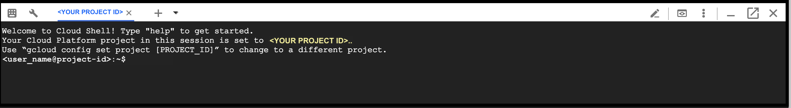

### 0.2. Clone this repo

From your shell, please run the following:

```
$> git clone https://github.com/canonical-labs/kaggle-kubeflow-tutorial.git
$> cd kaggle-kubeflow-tutorial
```

## 1. Create a Virtual Machine

These instructions assume you have access to an Ubuntu operating system. If you already have access to an Ubuntu environment with sufficient memory (eg at least 16GB), processing power (eg at least 4 cores), and disk space (at least 100GB free), and you are comfortable installing this software locally, then skip this step and go to 2.

Another benefit of a virtual machine is that it will give you a known starting place. There are multiple ways to create a VM - either on your laptop if it has enough juice, in a public cloud, or in your datacenter.

In this example, we'll use Google's cloud to create a VM. A full set of options and scripts are provided in the [gcp](gcp) directory, including the [gcp/README](gcp/README.md)

The command summary to create a VM in GCP:

```
$> export GCP_PROJECT=<the Project Id of the project you created>
$> gcp/network_create.sh
$> gcp/compute_create.sh
## NB: copy_scripts.sh will error if the VM isn't ready. Please re-run until it is successful.
$> gcp/copy_scripts.sh
$> gcp/compute_ssh.sh
```

## 2. Make sure you have a GITHUB TOKEN

*NB: experimental versions of Kubeflow don't require a GITHUB TOKEN. Once tested, these instructions will be updated and this step will be removed*

You'll need to generate a github token. You can do this on [github](https://github.com/settings/tokens)
- You only need to grant access to public repositories (eg public_repo checkbox)

## 3.0 Install Tools

### 3.1 Install Microk8s and Kubeflow install tools

The following commands are idempotent - they only install things if they are missing. At the end, you'll have a Kubeflow that you can log into. The last command will print the **port** number of the JupyterHub notebook. Combine that with the IP address of your ubuntu machine (eg the external IP address of a GCP VM instance)

```
:~$ export GITHUB_TOKEN=<your token>
:~$ ./scripts_download.sh
:~$ ./scripts_run.sh
```
You should see the Jupyter port number at the end:


**NB: If you run into errors, run the cleanup script and try again:**

```
:~$ ./cleanup_k8s.sh
```

### 3.2 [*Optional*] Allow access to the kubernetes dashboard

```
:~$ ./expose-dashboard.sh
```

Running this script on the server will do the following:
1) Run kubectl proxy
2) Add an RBAC account and cluster role binding for access
3) Print the token for that relationship (to be used in the UI)
4) Print the URL to use.

### 3.0 Exit the VM

At this point, there is nothing more that you need to do directly on the server. Time to exit the VM.

```
:~$ exit
```


## 4. Create a JupyterHub server based on Kaggle

**NB: This step can take several minutes**. If running in a public cloud, this can take around 10 minutes. If running locally, the time will be based on your network speed and latency.

### 4.1. Enter the JupyterHub URL in the browser

1. If running a VM, go back to your laptop and run:

```
gcp/compute_list.sh
```


2. Use the **EXTERNAL_IP** address in your browser, combined with the **PORT** address from the ` ./scripts_run.sh` command.

```
http://<EXTERNAL_IP>:<PORT>
```


3. You should then see this screen. **Press Start My Server**.


### 4.2. Launch Jupyter Server

This next part will take around 10 minutes when running in a public cloud. Locally it could take much longer. The reason is that the kaggle image is around 21GB. In other words, you are downloading 21GB of data.

This is what the screen should look like after you enter these values:

- kaggle image: `gcr.io/kubeflow-images-public/kaggle-notebook:v20180713`
- CPU: `4.0`
- MEM: `10Gi`

The screen:


## 5. Signup to Kaggle

### 5.1. Kaggle

- You need to join kaggle and download an API token.


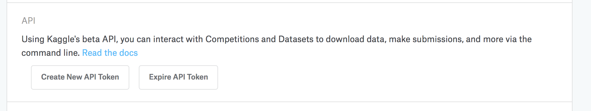


### 5.2. Join Kaggle Competition


- You'll need to **join** the [titanic competition](https://www.kaggle.com/c/titanic)


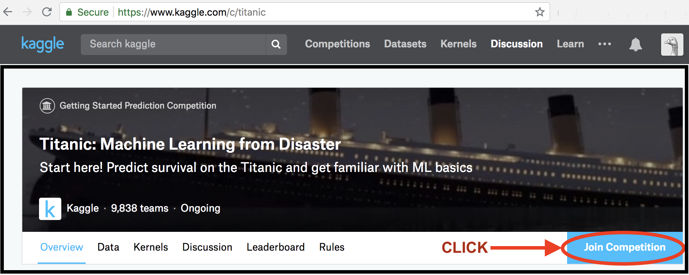


## 6. Install Kaggle in the Jupyter Terminal

### 6.1 Create a new Terminal in Jupyter

#### 6.1.1. Top level Menu

Jupyter lets you create a terminal, ie a shell, which allows you to run commands.

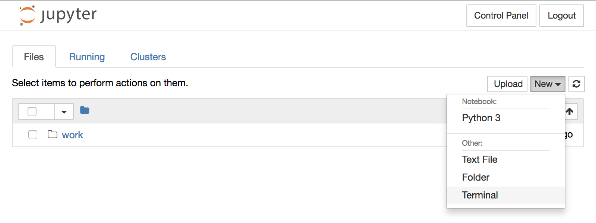

#### 6.1.1. Blank Terminal

The result is the start of a new Terminal that allows you to enter the commands in the
next section

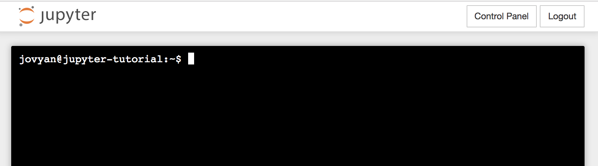


### 6.2. Execute commands in the Terminal

Now that you have a terminal on your Jupyter account, you'll need to install the kaggle CLI:

```
jovyan@jupyter-tutorial:~$ export PYTHONUSERBASE=/home/jovyan/.local
jovyan@jupyter-tutorial:~$ pip install --user kaggle
jovyan@jupyter-tutorial:~$ export PATH=/home/jovyan/.local/bin:$PATH
```

## 7. Download the Titanic Competition and a Kernel

The Kernel holds the notebook, which you'll start from the web browser.

### 7.1. Titanic Competition

```
jovyan@jupyter-tutorial:~$ export KAGGLE_USERNAME=<your account>
jovyan@jupyter-tutorial:~$ export KAGGLE_KEY=<your key>
jovyan@jupyter-tutorial:~$ mkdir ~/input; cd ~/input; kaggle competitions download -c titanic
```

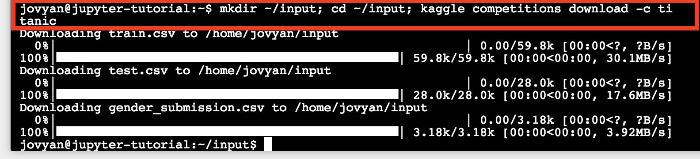


### 7.2. A Titanic Kernel

```
jovyan@jupyter-tutorial:~$ cd ~/work; kaggle kernels pull arthurtok/introduction-to-ensembling-stacking-in-python
```

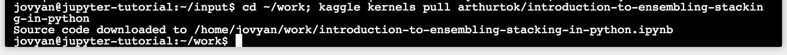


## 8. Run the notebook

Open the notebook in the browser, and run all cells.

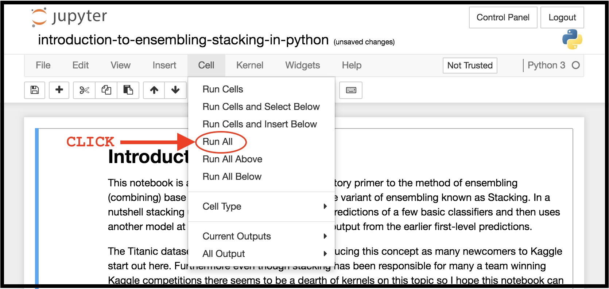

## 9. Review Visualization

Here are a few examples of the visualizations that are present in the notebook:

#### 9.1. Visual 1

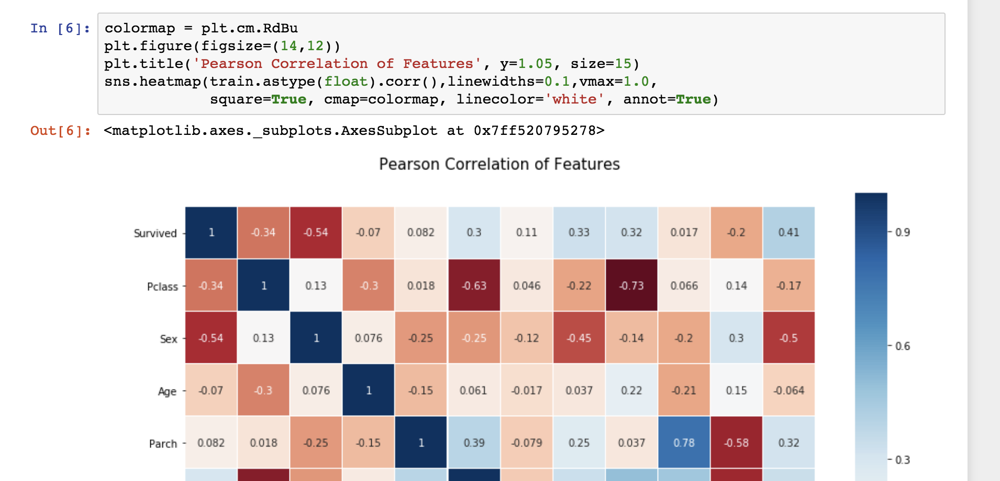

#### 9.2. Visual 2

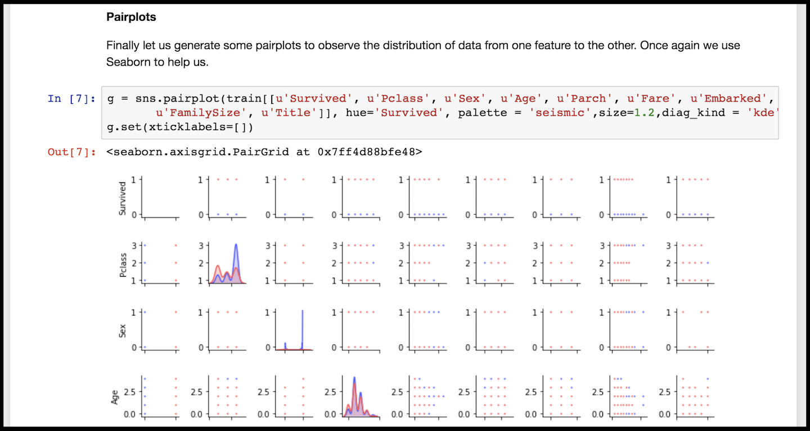

#### 9.3. Visual 3

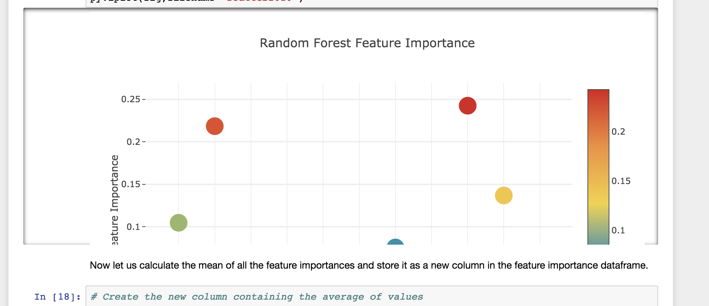

#### 9.4. Visual 4

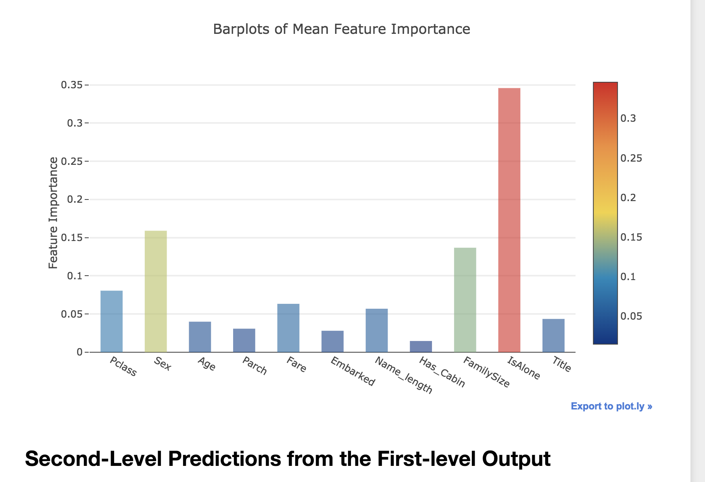

#### 9.5. Visual 5

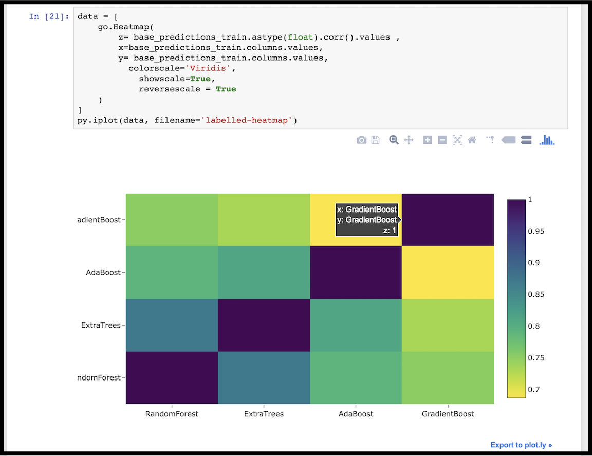


## 10. Delete your VM

Once you are done exploring, please delete your VM. Otherwise you'll continue to incur some costs associated with the running VM.

```
gcp/compute_delete.sh
```

## Summary of all steps

Here is a summary of all the steps, starting from the initial shell:

```
# From initial shell:
# =======================
git clone https://github.com/canonical-labs/kaggle-kubeflow-tutorial.git
cd kaggle-kubeflow-tutorial
export GCP_PROJECT=<the Project Id of the project you created>
gcp/network_create.sh
gcp/compute_create.sh
gcp/copy_scripts.sh
gcp/compute_ssh.sh

# From the VM:
# ============
export GITHUB_TOKEN=<your token>
./scripts_download.sh
./scripts_run.sh # note the jupyterhub port number
# Next Line is Optional
./expose-dashboard.sh
exit

# From the initial shell:
# =======================
gcp/compute_list.sh # note the external IP address

# From the browser
# ================
http://<EXTERNAL_IP>:<PORT>
# enter any username / password
# <click> Start My Server
# gcr.io/kubeflow-images-public/kaggle-notebook:v20180713 ,, 4.0 ,, 10Gi
# <click> Spawn

# From jupyter terminal:
# ======================
# <click> New --> Terminal
export PYTHONUSERBASE=/home/jovyan/.local
pip install --user kaggle
export PATH=/home/jovyan/.local/bin:$PATH
export KAGGLE_USERNAME=<your account>
export KAGGLE_KEY=<your key>
mkdir ~/input; cd ~/input; kaggle competitions download -c titanic
cd ~/work; kaggle kernels pull arthurtok/introduction-to-ensembling-stacking-in-python

# <click> Jupyter logo
# <click> work folder
# <click> the notebook introduction-to..
# <click>  Cell -> Run All
# View the results and code

# From the initial shell:
# =======================
gcp/compute_delete.sh

```
