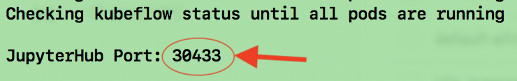
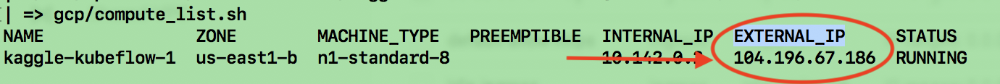
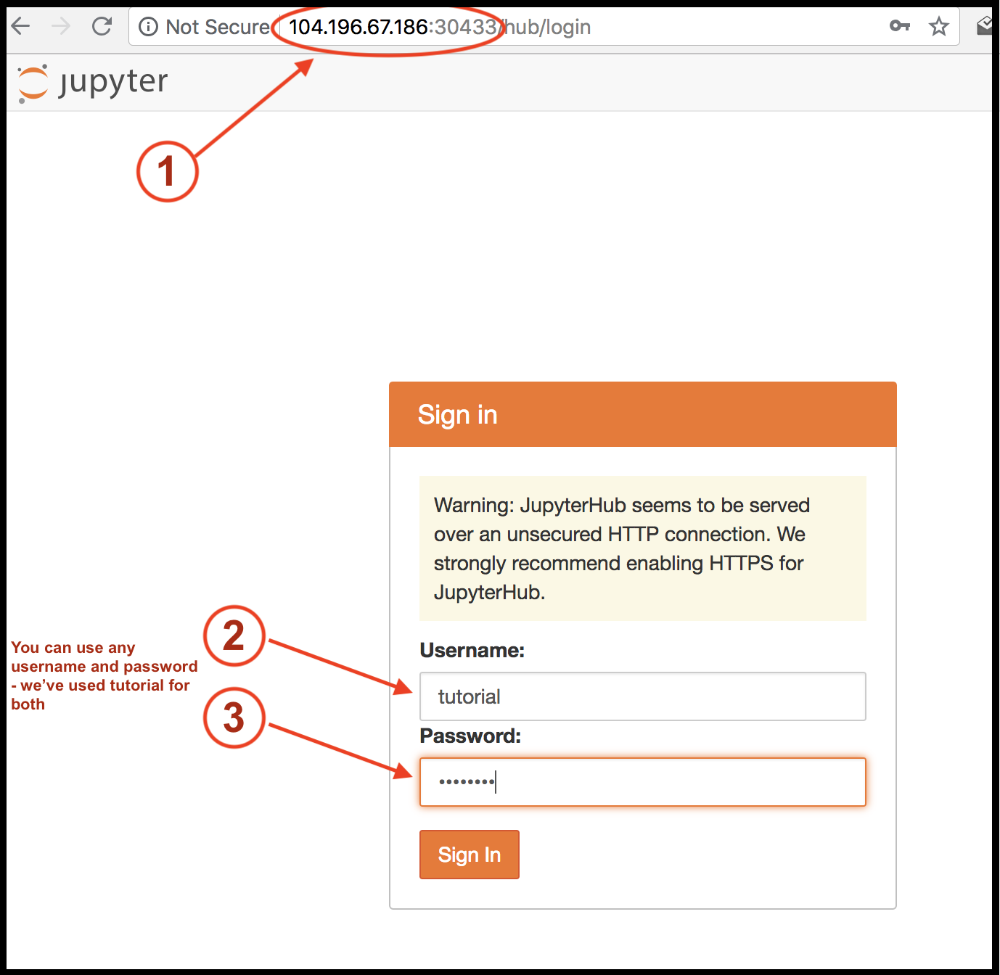
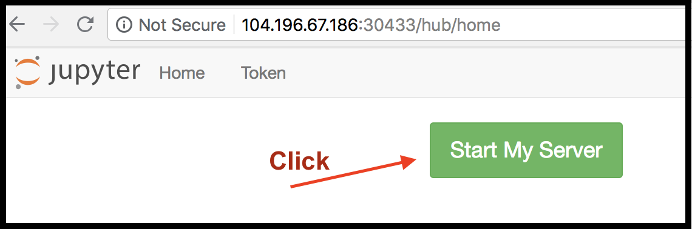
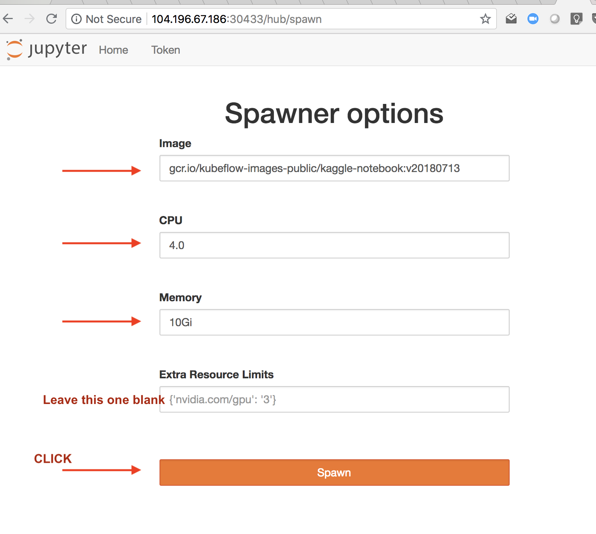

# Kaggle on Kubeflow on Ubuntu

This is a simple tutorial that walks through running a kaggle experiment on kubeflow on ubuntu.
These instructions are highly reproducible and you'll be able to leverage them for any competition, with the ability to run your experiments locally or in the cloud.

This tutorial is inpired by the [Kaggle on Kubeflow](https://www.kubeflow.org/blog/kaggle_on_kubeflow/) blog post on [kubeflow.org](https://www.kubeflow.org/).


# Setup Instructions

## 0. Clone this repo

For instance:
```
$> git clone https://github.com/canonical-labs/kaggle-kubeflow-tutorial.git
$> cd kaggle-kubeflow-tutorial
```

## 1. Create a Virtual Machine

These instructions assume you have access to an Ubuntu operating system. If you already have access to an Ubuntu environment with sufficient memory (eg at least 16GB), processing power (eg at least 4 cores), and disk space (at least 100GB free), and you are comfortable installing this software locally, then skip this step and go to 2.

Another benefit of a virtual machine is that it will give you a known starting place. There are multiple ways to create a VM - either on your laptop if it has enough juice, in a public cloud, or in your datacenter.

In this example, we'll use Google's cloud to create a VM. A full set of options and scripts are provided in the [gcp](gcp) directory, including the [gcp/README](gcp/README.md)

The command summary to create a VM in GCP:

```
$> export GCP_PROJECT=<the Project Id of the project you created>
$> gcp/network_create.sh
$> gcp/compute_create.sh
## NB: copy_scripts.sh will error if the VM isn't ready. Please re-run until it is successful.
$> gcp/copy_scripts.sh
$> gcp/compute_ssh.sh
```

## 2. Make sure you have a GITHUB TOKEN

*NB: experimental versions of Kubeflow don't require a GITHUB TOKEN. Once tested, these instructions will be updated and this step will be removed*

You'll need to generate a github token. You can do this on [github](https://github.com/settings/tokens)
- You only need to grant access to public repositories (eg public_repo checkbox)

## 3. Setup Kubeflow and necessary Tools

The following commands are idempotent - they only install things if they are missing. At the end, you'll have a Kubeflow that you can log into. The last command will print the **port** number of the JupyterHub notebook. Combine that with the IP address of your ubuntu machine (eg the external IP address of a GCP VM instance)
```
:~$ ./scripts_download.sh
:~$ export GITHUB_TOKEN=<your token>
:~$ ./scripts_run.sh
```
You should see the Jupyter port number at the end:


**NB: If you run into errors, run the cleanup script and try again:**
```
:~$ ./cleanup_k8s.sh
```

## 4. Create a JupyterHub server based on Kaggle

**NB: This step can take several minutes**. If running in a public cloud, this can take around 10 minutes. If running locally, the time will be based on your network speed and latency.

### 4.a. Enter the JupyterHub URL in the browser

1. If running a VM, go back to your laptop and run:
```
gcp/compute_create.sh
```


2. Use the **EXTERNAL_IP** address in your browser, combined with the **PORT** address from the ` ./scripts_run.sh` command.
```
http://<EXTERNAL_IP>:<PORT>
```


3. You should then see this screen. **Press Start My Server**.



### 4.b. Launch Jupyter Server

This next part will take around 10 minutes when running in a public cloud. Locally it could take much longer. The reason is that the kaggle image is around 21GB. In other words, you are downloading 21GB of data.

This is what the screen should look like after you enter these values:

- kaggle image: `gcr.io/kubeflow-images-public/kaggle-notebook:v20180713`
- CPU: `4.0`
- MEM: `10Gi`

The screen:




## 5. Signup to Kaggle

### Kaggle

- You need to join and download your username and token.
- You'll need to **join** the [titanic competition](https://www.kaggle.com/c/titanic)

## 6. Follow the remainig instructions to launch a notebook.

Follow the instructions on [Kaggle on Kubeflow](https://www.kubeflow.org/blog/kaggle_on_kubeflow/) blog post on [kubeflow.org](https://www.kubeflow.org/).

**TBD: Move those instructions to this section**
